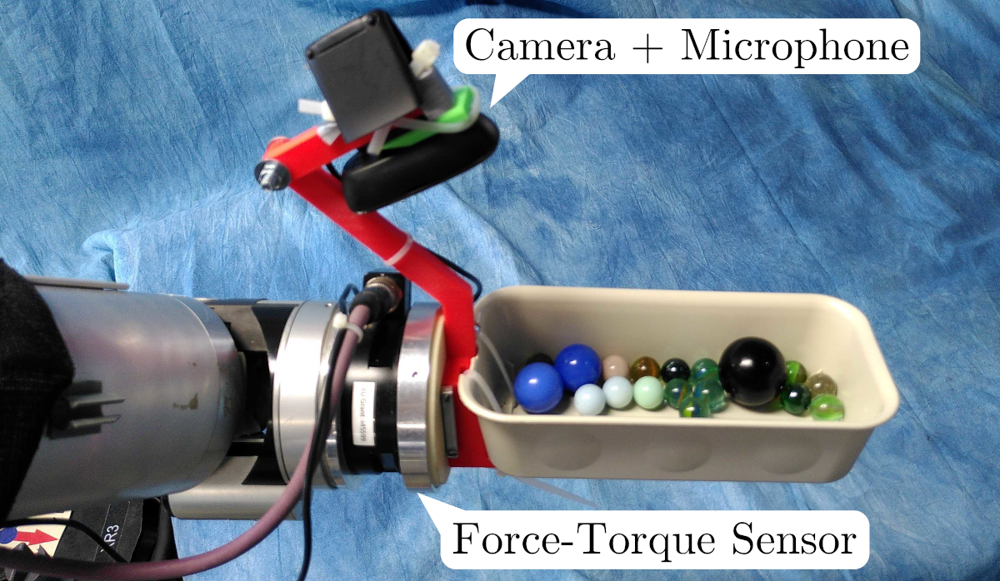
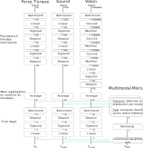

# Marble Regression

This is code for a robotic machine learning project where I trained a model to estimate the number of marbles in a robot's hand from audio, vision, and force-torque sensor input.

The experiments and model are explained in detail in my upcoming PhD thesis. Until then, here's a broad overview of what happens in this repo:

I recorded 200 executions of a robot tilting a tray-like end-effector with a random amount of marbles (n_marbles sampled from the interval \[0,20\]).
In each trial I recorded a time-series of sensor input in force-torque, audio, and camera images (see image of setup below). I then trained three different models to estimate the number of marbles in the tray-like 
end-effector from either of the sensor modalities individually.

It's possible to estimate the number of marbles from either sensor modality. It's somewhat surprising to me that it works also just using sound. However, the point of this experiment was to show that a multimodal approach
that uses the three modalities jointly is more robust to adverse conditions. That's why I also combined the individual, unimodal estimators using a Mixture of Experts (MoE) approach. My experiments show that the multimodal 
MoE approach can cope better with adverse conditions where we a) glue additional weights to the tray, b) play loud music, and c) visually cover the tray with a piece of cloth.

I will present the results in detail in my upcoming PhD thesis.

## Robot Setup

I 3D printed a fixture to mount a tray and a camera to the force-torque sensor of a WAM robot. 

## The Machine Learning Model(s)

Three individual models to estimate the number of marbles from timeseries. One model uses force-torque, one uses sound, and another one uses vision input. Finally, there is also a mixture model that combines these models
based on novelty detection which I do per sensor modality.

## How to run

You won't be able to run this without the data and I did not upload it yet because I need to figure out if I am allowed to share the data. However, the code is here for reference and a starting point to adapt the
project is the script regression_ft_sound_vision.py